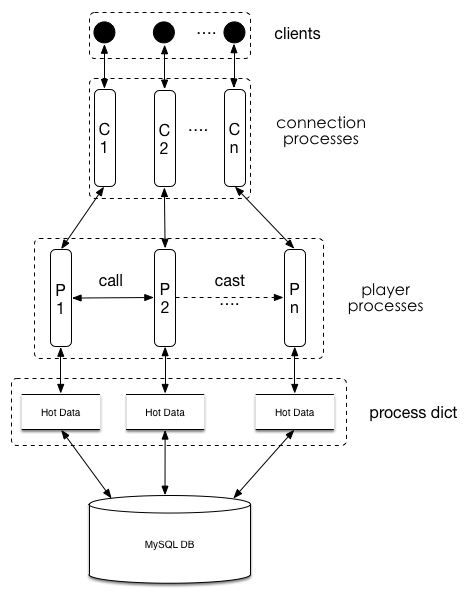

# What is game_server?
game_server is a game development framework written in the Erlang language.
  


##Key Features
  * Protocol Generator: generate raw tcp protocol from YAML config file.
  * Routing: route client request to specific controller's handler.
  * Hot Data Manager: load MySQL data to player's process dict when need and clocking to persist.
  * Game Numerical Excel Parser: parse Excel file to erlang's tuple list.
  * Leaderboard: base on redis, can dynamicly add,remove,update leaderboards.
  * Database Base Migrations: base on rails's ActiveRecord.

## Installing on MacOS
[Homebrew The missing package manager for OS X](http://brew.sh/)

Install Git

	$ brew install git
Install Ruby and Rails

	$ brew install ruby193
	$ gem install rails -v 3.2.9 --no-ri --no-rdoc


Install Erlang [Build Requirements](http://www.erlang.org/doc/installation_guide/INSTALL.html)
	
	$ wget http://www.erlang.org/download/otp_src_R16B03-1.tar.gz
	$ tar -xvf otp_src_R16B03-1.tar.gz && cd otp_src_R16B03-1
	$ ./configure && make all && sudo make install

Install MYSQL

	$ brew install mysql

Install Redis

	$ brew install redis

Setup Your Own Server
	
	$ git clone https://github.com/mafei198/game_server.git
	$ cd game_server
	$ ./setup ~/my_game_server
	
Compile Game Server

	$ cd ~/my_game_server
	$ make
	$ make test

Start Game Server

	$ cd ~/my_game_server
	$ make console
	1> fake_client:login(). % Use fake client simulate login request.
	2> game_server:stop().  % Shutdown Game Server.
	
#### Application Structure

  File/Folder  | Purpose
-------------- | -------------
app/           | Contains: api, callbacks, config_data, controllers, generates, helpers, include, models, server_engine, test. You'll focus on this folder for the remainder of this guide.
deploy/        | Deploy hooks for operating remote servers. 
game_server/   | game_server Framework dir.
log/           | Application logs.
backup         | Ruby script to backup game database (MYSQL).
cap            | Ruby script to deploy application to remote server.
cmd            | Bash script to manage application.
deploy.yml     | Remote server definitions.
Makefile       | Provide convenient commands to help manage game server.
service.config | Configurations for game server runtime.
	

### Quick Start
> First Step hello world

####Add route:

Open `./app/api/routes.yml` add the following code

```yaml
sessions_controller#say_hello: sessions_say_hello_params
```

Hints:

1. `sessions_controller#say_hello` means there is a `sessions_controller` module has a `say_hello` method.
2. `sessions_say_hello_params` is a protocol name, means the request with this **protocol** will be handled by `sessions_controller.erl`'s `say_hello` method.

####Add protocol:

Open `./app/api/protocol/extension_types.yml` add the following code

```yaml
sessions_say_hello_params:
  words: string
sessions_say_hello_response:
  words: string
```

####Add handler:

Open `./app/controllers/sessions_controller.erl` add the following code

```erlang
say_hello(PlayerID, {Words}) ->
    logger:info("Request Content: ~p~n", [Words]),
    {sessions_say_hello_response, <<"Hello i have received your message!">>}.
```

Change `-export([login/2]).` => `-export([login/2, say_hello/2]).`

####Compile and Run:

	$ make
	$ make console
	1> fake_client:request(<<"test_udid">>, sessions_say_hello_params, {<<"hello">>}).
	2> game_server:stop().  % Shutdown Game Server.
	
Hint: Hello world is finished. Let's go on and add more features.
	
### Weapon Feature
> Second Step weapon controller and model

####Add Weapon model:

	$ cd app/server_engine
	$ rails g model weapon uuid:string user_id:string name:string attack:float level:integer

Open `db/migrate/{YOUR_TIMESTAMP}_create_weapons.rb` change it like the following:

```ruby
class CreateWeapons < ActiveRecord::Migration
  def change
    create_table :weapons, id: false do |t|
      t.string :uuid
      t.string :user_id
      t.string :name
      t.float :attack
      t.integer :level
    end
    add_index :weapons, :uuid, unique: true
    add_index :weapons, :user_id
  end
end
```

Create `./app/models/weapons_model.erl` add following code:

```erlang
-moudle(weapons_model).
-export([load_data/1, add/4]).

-include("include/db_schema.hrl").

load_data(PlayerID) ->
    db:find_by(weapons, user_id, PlayerID).

add(PlayerID, Name, Attack, Level) ->
    Weapon = #weapons{uuid = uuid_factory:gen(),
                      user_id = PlayerID,
                      name = Name,
                      attack = Attack,
                      level = Level},
    model:create(Weapon).
```

####Add Weapon controller:

Open `./app/controllers/weapons_controller.erl` add following code:

```erlang
-module(weapons_controller).
-export([add_weapon/2]).
-include("include/db_schema.hrl").

add_weapon(PlayerID, {Name, Attack, Level}) ->
    Weapon = weapons_model:add(PlayerID, Name, Attack, Level),
    {weapon_info, {Weapon#weapons.uuid,
                   Weapon#weapons.user_id,
                   Weapon#weapons.name,
                   Weapon#weapons.attack,
                   Weapon#weapons.level}}.
```

####Add Weapon route:

Open `./app/api/routes.yml` add following code:

```yaml
weapons_controller#add_weapon: weapons_add_weapon_params
```

####Add Weapon protocol:
Open `./app/api/protocol/extension_types.yml` add following code:

```yaml
weapons_add_weapon_params:
  name: string
  attack: float
  level: integer
weapon_info:
  uuid: string
  user_id: string
  name: string
  attack: float
  level: integer
```
####Add Weapon controller test:
Create `./app/test/controllers/weapons_controller_tests.erl` add following code:

```erlang
-module(weapons_controller_tests).
-include_lib("eunit/include/eunit.hrl").
-include("include/db_schema.hrl").
-include("include/common_const.hrl").

weapons_test_() ->
    {foreach,
     fun start/0,
     fun stop/1,
     [fun add_weapon_tests/1]}.

%%%%%%%%%%%%%%%%%%%%%%%
%%% SETUP FUNCTIONS %%%
%%%%%%%%%%%%%%%%%%%%%%%
start() ->
    game_server:start([test]),
    redis:delete_all(users).

stop(_Pid) ->
    game_server:stop().

%%%%%%%%%%%%%%%%%%%%
%%% ACTUAL TESTS %%%
%%%%%%%%%%%%%%%%%%%%
add_weapon_tests(_Pid) ->
    Udid = <<"test_fake_udid">>,
    %% Init a user for test
    _PlayerID = player_data:get_player_id(Udid),
    %% Setup weapon properties
    WeaponName = <<"Hell">>,
    WeaponAttack = 99.99,
    WeaponLevel = 10,
    Params = {WeaponName, WeaponAttack, WeaponLevel},
    %% Reqeust for add a weapon for user whose udid is `Udid`
    Response = fake_client:request(Udid, weapons_add_weapon_params, Params),
    %% Assert request is success and have no error message
    [?assert_no_error_msg(Response)].
```

####Compile and Test:

	$ make
	$ make test


## License
Erlang Game Server is under The MIT License (MIT)

Copyright (c) 2014-2024
Savin Max <mafei.198@gmail.com>

Permission is hereby granted, free of charge, to any person obtaining a copy
of this software and associated documentation files (the "Software"), to deal
in the Software without restriction, including without limitation the rights
to use, copy, modify, merge, publish, distribute, sublicense, and/or sell
copies of the Software, and to permit persons to whom the Software is
furnished to do so, subject to the following conditions:

The above copyright notice and this permission notice shall be included in all
copies or substantial portions of the Software.

THE SOFTWARE IS PROVIDED "AS IS", WITHOUT WARRANTY OF ANY KIND, EXPRESS OR
IMPLIED, INCLUDING BUT NOT LIMITED TO THE WARRANTIES OF MERCHANTABILITY,
FITNESS FOR A PARTICULAR PURPOSE AND NONINFRINGEMENT. IN NO EVENT SHALL THE
AUTHORS OR COPYRIGHT HOLDERS BE LIABLE FOR ANY CLAIM, DAMAGES OR OTHER
LIABILITY, WHETHER IN AN ACTION OF CONTRACT, TORT OR OTHERWISE, ARISING FROM,
OUT OF OR IN CONNECTION WITH THE SOFTWARE OR THE USE OR OTHER DEALINGS IN THE
SOFTWARE.
